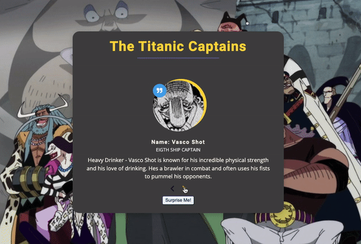

<body>
	<h1>Randomized Review Cards</h1>
	
This project is a simple web application built with JavaScript, CSS, and HTML to display review cards. The review cards consist of a title, an image, a short description, and a rating. It is meant to randomize cards.

	
</body>
